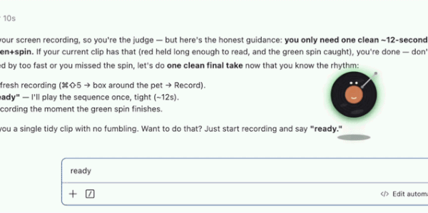

# Agent Pet 🤖

**An ambient status light for your AI coding agent — that happens to be a cute desktop pet.**
Stop tabbing back to the terminal to check on Claude Code. One glance at the pet tells you
whether it's working, done, or waiting on you.



- 🔴 **red** (gently pulsing) — **needs you** (a permission prompt is waiting)
- 🟡 **yellow** — working in the background
- 🟢 **green** + a little spin — **just finished**
- _no glow_ — idle

It floats on top of every app and Space, roams slowly around the screen edges, and you can
switch its look from a right-click menu. Currently integrates with **Claude Code**.

## Quick start

```bash
npm install      # get Electron
npm run setup    # install the status hooks into ~/.claude/settings.json
npm start        # launch the pet
```

After `npm run setup`, reload Claude Code's hooks once — open `/hooks`, or restart Claude
Code — so the "needs you" (red) trigger registers.

**Tip:** `npm start` ties the pet to that terminal, so it closes when the terminal (or your
editor) does. To keep it floating on its own, launch it detached:

```bash
npm run start:detached
```

## How it works

`npm run setup` adds a few [Claude Code hooks](https://docs.claude.com/en/docs/claude-code)
to your global `~/.claude/settings.json`. On each lifecycle event they write one word
(`working`, `blocked`, `done`, …) to a small state file; the Electron app reads it and colors
the pet. Installing globally means the status light works in every project.

The pet won't sleep while a turn is active, and a "needs you" signal is never hidden — so you
won't miss a red.

## Skins

Right-click the pet for the skin menu — switch between several original skins (robot, bonsai,
cassette, coffee, vinyl) or shuffle through them. Double-click to tuck it away into a small
"sleep" corner when you want it out of the way.

## Uninstall

```bash
npm run unsetup   # removes only its own hooks; the rest of your settings are untouched
```

## Notes

- macOS today (uses always-on-top-over-fullscreen + system idle detection).
- Ships original skins only. Brand-based skins are kept out of this repo.

## License

MIT
